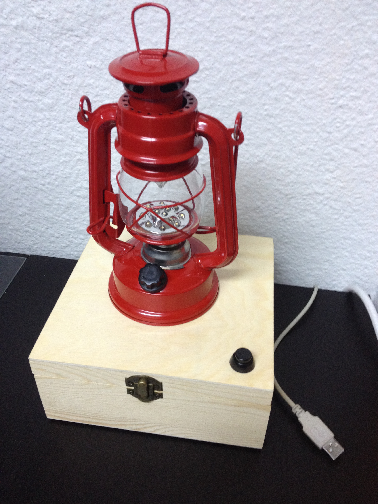
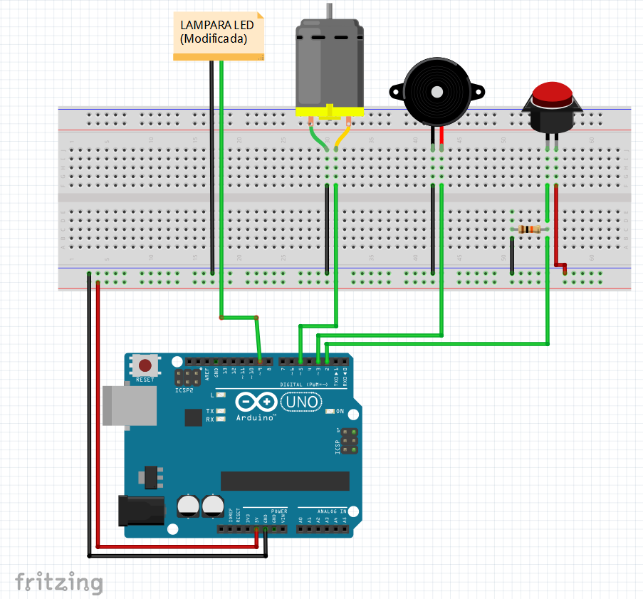
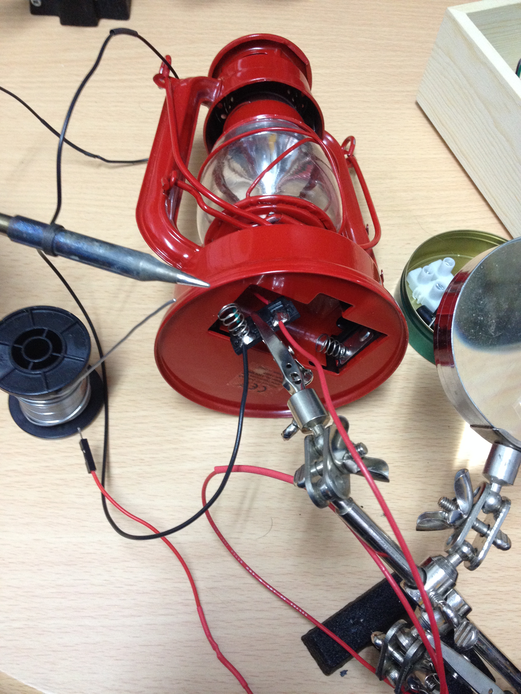
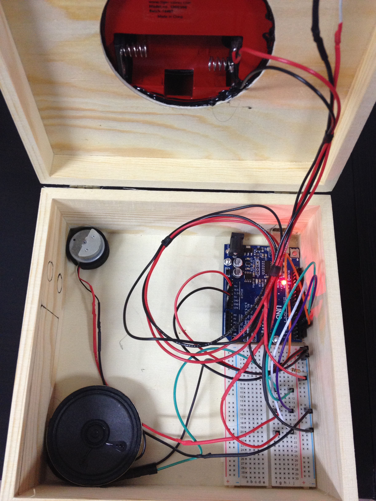

# Deadline-alarm

Dispositivo que nos avisa en momentos programados de manera visual y auditiva usando Node.js (J5) y Arduino

### [DEMO](https://twitter.com/kom_256/status/685056191341408256)

### Dependencias

- [Johnny-five](https://www.npmjs.com/package/johnny-five)
- [J5-songs](https://www.npmjs.com/package/j5-songs)
- [Scheduled](https://www.npmjs.com/package/scheduled)

### Esquemas
- **Protoboard:**

- **Componentes:**
	- Motor (Vibración)
	- Buzzer
	- Botón
	- Resistencia 10k oms
	- Lámpara modificada

- **Conexiones:**
	- 5v
	- GND
	- pin 9 (lámpara)
	- pin 5 (motor)
	- pin 3 (zumbador)
	- pin 2 (botón)

### Construcción

**Modificación de la lámpara:**

**Montaje Final:**
